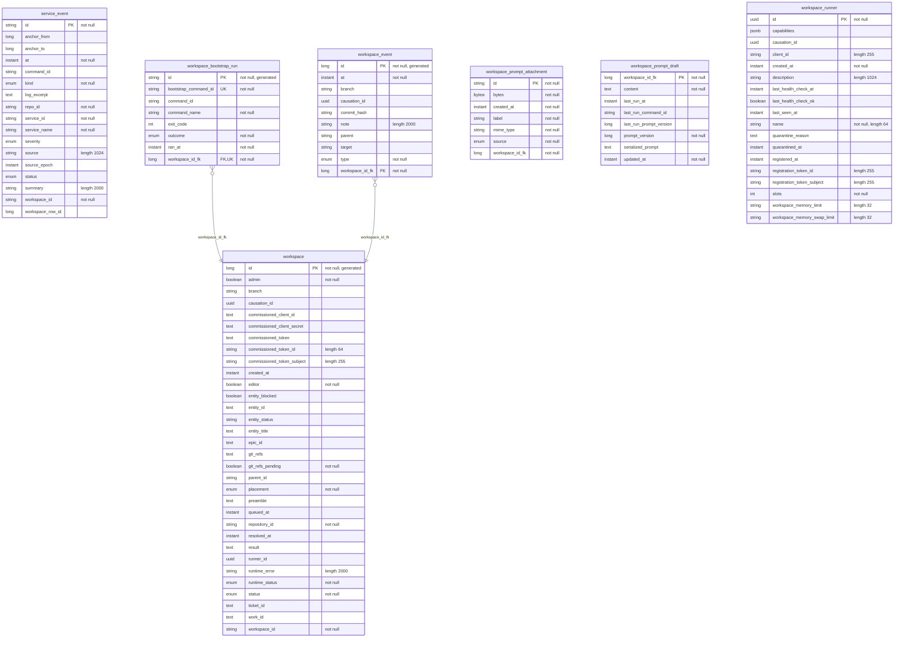

<!-- Generated by `qits database diagram` (jpa). Do not edit: the entity-diagram automation rewrites this file on every release request fold. -->
# Persistence unit `workspaces`

Datasource `workspaces` · package `eu.wohlben.qits.workspaces.entity` · 7 entities

